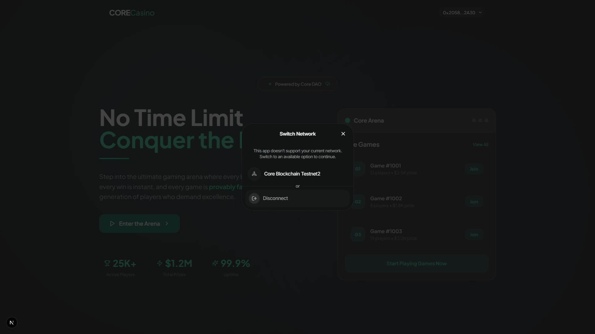
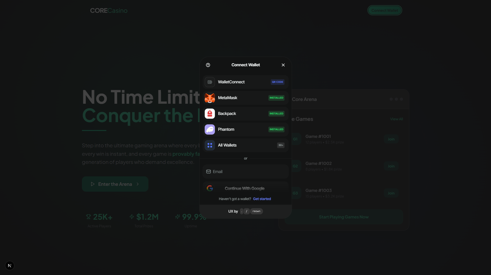
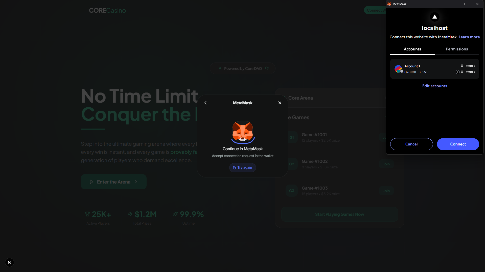
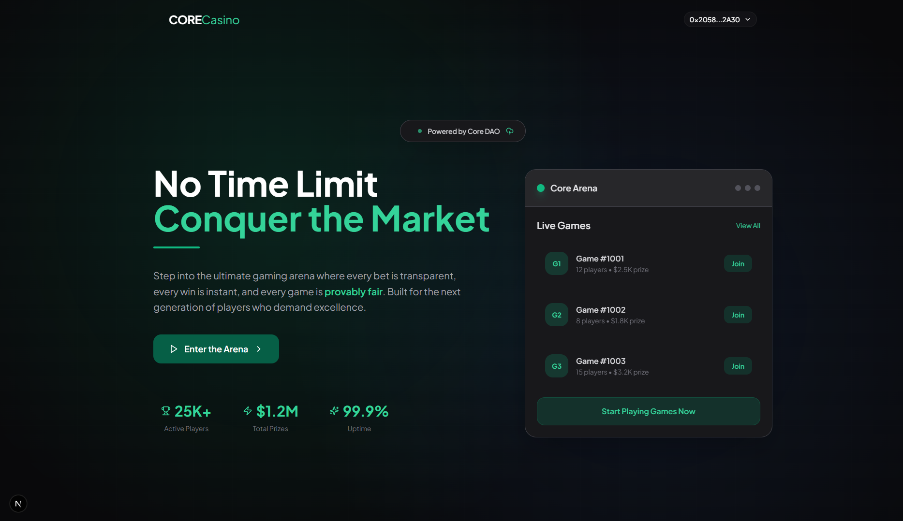

# CORECasino 

Welcome to **CORECasino**, a next-generation Web3 casino platform built on the Core Blockchain. Enjoy provably fair, instant-settlement games powered by EVM smart contracts and a seamless, interactive user experience.

---

## 🚀 Overview

CORECasino is designed for players who value transparency, fairness, and speed. The platform currently features **DiceDuel**—a fast-paced, 1:1 dice game where every bet is settled instantly on-chain. Built with Next.js, Wagmi, Foundry, and Core Blockchain, CORECasino ensures a secure and enjoyable gaming experience for all users.

---

## 🖼️ Screenshots

### 1. Network Switching

Easily switch to the correct Core Blockchain network for optimal gameplay.



---

### 2. Wallet Connection

Connect your wallet using MetaMask, Backpack, Phantom, WalletConnect, or even Google for a smooth onboarding process.



---

### 3. MetaMask Authorization

Authorize your wallet connection securely with MetaMask.



---

### 4. Landing Page & Game Lobby

View live games, join the arena, and track platform stats—all from a clean, modern interface.



---

## 🎮 Game: DiceDuel

**DiceDuel** is the first game available on CORECasino. Here’s how it works:

- **Entry**: Deposit 0.1 CORE to join a game.
- **Prediction**: Choose Odd or Even.
- **Randomness**: The smart contract generates a random number (1-6).
- **Win**: Correct prediction pays out 1.8x your entry.

**Provably Fair:** All randomness and results are verifiable on-chain.

---

## ⚡ Features

- **Provably Fair Gameplay:** On-chain randomness, transparent outcomes.
- **Instant Settlement:** Fast, EVM-based transactions.
- **Non-Custodial:** You control your funds at all times.
- **Multi-Wallet Support:** MetaMask, WalletConnect, Backpack, and more.
- **Mobile-Optimized:** Fully responsive design for any device.
- **Upgradable Smart Contracts:** Built with Foundry for future expansion.

---

## 🛠️ Tech Stack

| Layer         | Tech Used                     |
|---------------|------------------------------|
| Frontend      | Next.js 14, Tailwind CSS     |
| Blockchain    | Core Blockchain (EVM)        |
| Smart Contract| Solidity (Foundry/Forge)     |
| Wallets       | Wagmi, viem, WalletConnect, Reown   |
| Infrastructure| Vercel, QuickNode            |

---

## 🏁 Getting Started

1. **Clone the Repo**
```
git clone https://github.com/beetlejusse/CORECasino.git
cd CORECasino
```

2. **Install Dependencies**
```
npm install
```

3. **Configure Environment**
- Copy `.env.example` to `.env.local` and update with your details.

4. **Run Locally**
```
npm run dev
```

---

## 🔧 Smart Contract Deployment

```
forge build
forge create --rpc-url [CORE_RPC_URL] --private-key [PRIVATE_KEY] src/DiceDuel.sol:DiceDuel
```


---

<!-- ## 🤝 Contributing

- Fork the repository
- Create your feature branch (`git checkout -b feature/amazing-feature`)
- Commit your changes (`git commit -m 'Add some amazing feature'`)
- Push to the branch (`git push origin feature/amazing-feature`)
- Open a Pull Request

--- -->

## ⚠️ Disclaimer

This project is for educational purposes only. Gambling involves financial risk. Use at your own discretion.
